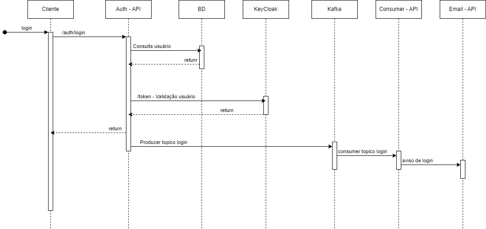

# Login

### Do Usuário
- Para efetuar o Login o usuário deverá informar o email e senha

### Do Sistema
- Deverá validar o email e senha do usuário
- Em caso de sucesso do login deverá dispara um email de novo acesso para o usuário
- Ao efetuar o login o usuário deverá ser direcionado para a página inicial do sistema
- **Primeiro login** Usuários com perfil admin(usuário que irá gerir o sistema) deverão ser direcionado para a tela de finalização de cadastro no . 
- **Primeiro login** Usuários com demais perfis deverão ser redirecionados para a tela de redefinição de senha(a primeira senha do funcionário será gerada automaticamente e enviada para o email cadastrado).
- O sistema deverá deslogar qualquer outro usuario que esteja logado com aquele mesmo usuário

### Diagrama de sequencia

